Australian TV network logos
===========================

Bunch of Aussie TV logos for use in MythTV, Kodi, whatever.

Samples
-------

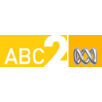
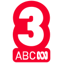
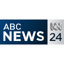
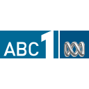
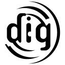

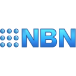
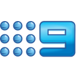

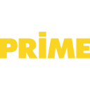
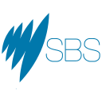
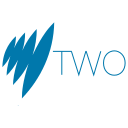
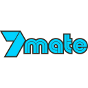

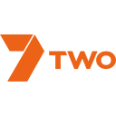
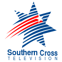

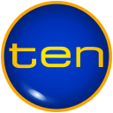

Contributing
------------

If you want to contribute a new logo please:

1. Provide an original SVG logo you created yourself (or otherwise have the copyright over)
2. There is no build process, so just make a pull request with the SVG and I'll do the rest.

License
-------

The files are licensed as Creative Commons Attribution. The designs in the files are owned by the respective networks, so probably best these are just for personal use. :)

